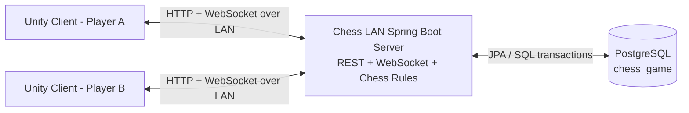
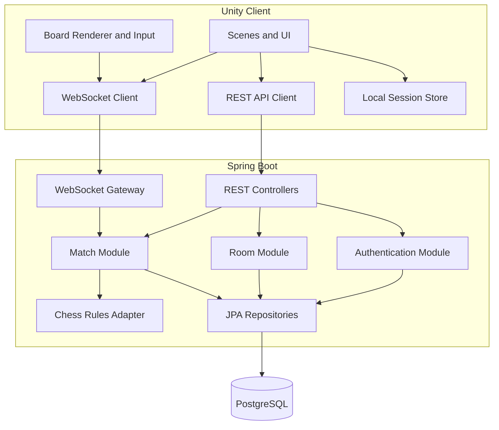
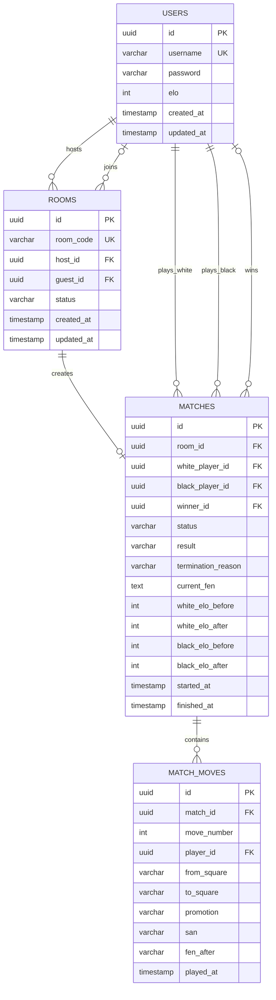
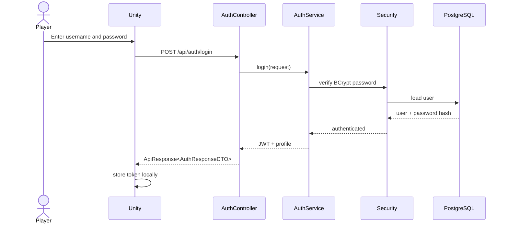
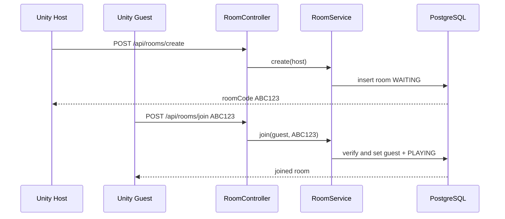
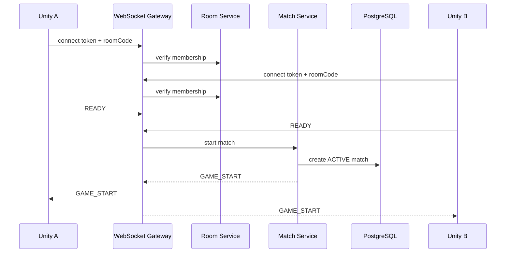
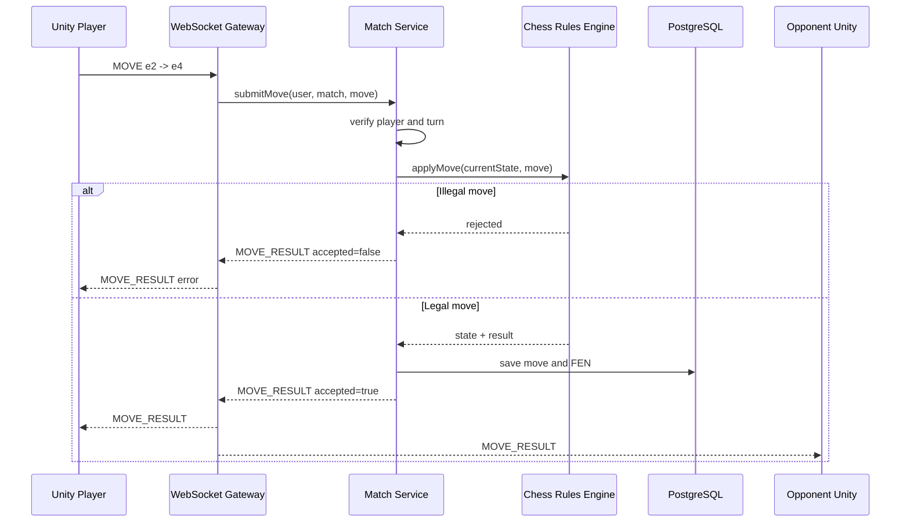
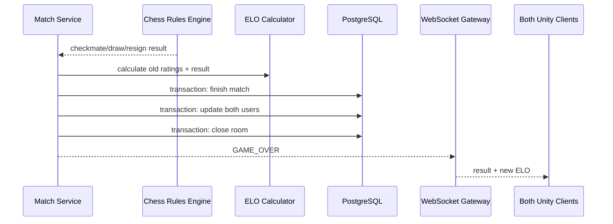

# Chess LAN Multiplayer - Unified Architecture

## 1. Document purpose

This document combines:

- `Chess_LAN_SpringBoot_Unity_Guide.md`: implementation flow for Unity, Spring Boot, PostgreSQL and LAN.
- `Chess_Full_Architecture_Design.md`: target modules, REST APIs, WebSocket events, match history and ELO.
- The current source code in `chess-lan-backend`.

The result is one architecture for the complete project, not two competing designs.

## 2. Product scope

The game supports two Unity players on the same LAN:

1. Create an account or log in.
2. View player profile and ELO.
3. Create a room or join by room code.
4. Connect to the room through WebSocket.
5. Play a server-authoritative chess match.
6. Save match result and move history.
7. Update both players' ELO.
8. Review match history.

## 3. Architecture principles

### 3.1 Server authoritative

Unity only sends player intent:

```json
{
  "type": "MOVE",
  "from": "e2",
  "to": "e4"
}
```

Spring Boot owns:

- Current board state.
- Whose turn it is.
- Legal move validation.
- Check, checkmate, stalemate and draw state.
- Match result.
- ELO update.

Unity must never send an authoritative message such as `"I won"`.

### 3.2 REST for durable commands, WebSocket for real-time game events

REST is used for:

- Signup, login and logout.
- Profile.
- Create and join room.
- Room lookup.
- Match history and match detail.

WebSocket is used for:

- Player ready state.
- Game start.
- Move submission and result.
- Draw offer/accept.
- Resign.
- Game over.
- Reconnection state sync.

### 3.3 PostgreSQL stores durable state

PostgreSQL stores:

- Users and ELO.
- Rooms.
- Completed or active matches.
- Move history.

Short-lived WebSocket sessions and active connection maps remain in server memory for the LAN MVP.

## 4. System context



Example LAN addresses:

```text
REST:      http://192.168.1.10:8080
WebSocket: ws://192.168.1.10:8080/ws/chess
Swagger:   http://192.168.1.10:8080/swagger-ui/index.html
```

## 5. Container architecture



## 6. Backend module design

### 6.1 Common module

Responsibilities:

- Security configuration.
- JWT parsing and generation.
- CORS and OpenAPI.
- WebSocket configuration.
- Shared `ApiResponse`.
- Global exception handling.

### 6.2 Authentication module

Responsibilities:

- Signup with BCrypt password hashing.
- Login and access-token generation.
- Logout response so Unity can clear its local token.
- Resolve authenticated player.

Current status: **implemented**.

### 6.3 User module

Responsibilities:

- Current player profile.
- ELO display.
- Later: public player summary and leaderboard.

Current status: profile **implemented**.

### 6.4 Room module

Responsibilities:

- Generate unique six-character room code.
- Assign host and guest.
- Manage `WAITING`, `PLAYING`, `FINISHED`.
- Prevent the host joining as guest.
- Prevent joining a full or closed room.

Current status: create/join/get room **implemented**.

### 6.5 Match module

Responsibilities:

- Create a match when both players are ready.
- Assign white and black.
- Keep active match state.
- Validate current player and turn.
- Pass move to chess rules engine.
- Persist accepted moves.
- Detect game over.
- Persist result and ELO changes in one transaction.
- Restore state after reconnect or server restart.

Current status: **implemented** for match creation, legal moves, checkmate, chess draw rules,
draw agreement, resignation, persistence and ELO.

### 6.6 Chess rules adapter

Do not hand-roll complete chess rules inside the WebSocket handler.

Define an internal interface:

```java
public interface ChessRulesEngine {
    GameState createInitialState();
    MoveValidationResult applyMove(GameState state, ChessMove move);
    GameState loadFromFen(String fen);
}
```

The adapter should use a proven Java chess library. The rest of the application depends on this interface rather than a specific library.

### 6.7 WebSocket gateway

Responsibilities:

- Authenticate handshake token.
- Verify room membership.
- Map sessions to room and user.
- Parse incoming event envelopes.
- Delegate business logic to `MatchService`.
- Broadcast resulting server events.
- Handle disconnect and reconnection.

The gateway must not contain chess business rules.

Current status: authenticated WebSocket, service delegation and legal move validation **implemented**.

## 7. Target backend package structure

```text
com.chesslan.game
├── ChessLanApplication
├── common
│   ├── config
│   ├── exception
│   ├── response
│   └── security
├── controller
│   ├── interfaces
│   └── impl
├── infrastructure
│   ├── BaseEntity
│   └── chess
│       └── ChessRulesEngineAdapter
├── mapper
├── model
│   ├── dto
│   │   ├── auth
│   │   ├── room
│   │   ├── match
│   │   ├── user
│   │   └── websocket
│   └── entity
├── repository
├── service
│   ├── interfaces
│   └── impl
└── websocket
    ├── ChessHandshakeInterceptor
    ├── ChessWebSocketHandler
    ├── SessionRegistry
    └── event
```

The existing project already follows most of this structure.

## 8. Data architecture

The current code uses UUID identifiers. Keep UUID consistently instead of mixing UUID and `BIGSERIAL`.

### 8.1 ERD



### 8.2 Entity ownership

- `UserEntity`: identity and current ELO.
- `RoomEntity`: lobby membership, not the chess board.
- `MatchEntity`: durable game aggregate and final result.
- `MatchMoveEntity`: accepted server moves only.

### 8.3 Room versus match

A room is a lobby:

```text
WAITING -> PLAYING -> FINISHED
```

A match is the actual chess game:

```text
CREATED -> ACTIVE -> WHITE_WON | BLACK_WON | DRAW | ABORTED
```

Keeping them separate avoids putting board state, ELO and history into the room table.

## 9. REST API contract

Every endpoint uses:

```json
{
  "code": 1000,
  "message": "Success message",
  "result": {},
  "path": "/api/...",
  "timestamp": "2026-06-24T..."
}
```

### 9.1 Authentication

| Method | Endpoint | Auth | Purpose | Status |
|---|---|---:|---|---|
| POST | `/api/auth/signup` | No | Create player and issue JWT | Implemented |
| POST | `/api/auth/login` | No | Verify credentials and issue JWT | Implemented |
| POST | `/api/auth/logout` | Yes | Confirm logout before Unity clears token | Implemented |

### 9.2 User

| Method | Endpoint | Auth | Purpose | Status |
|---|---|---:|---|---|
| GET | `/api/users/me` | Yes | Current player profile and ELO | Implemented |
| GET | `/api/users/{id}` | Yes | Public player summary | Future |
| GET | `/api/users/leaderboard` | Yes | ELO ranking | Future |

### 9.3 Room

| Method | Endpoint | Auth | Purpose | Status |
|---|---|---:|---|---|
| POST | `/api/rooms/create` | Yes | Create waiting room | Implemented |
| POST | `/api/rooms/join` | Yes | Join by room code | Implemented |
| GET | `/api/rooms/{roomCode}` | Yes | Read room state | Implemented |
| POST | `/api/rooms/{roomCode}/leave` | Yes | Leave waiting room | Future |

### 9.4 Match

| Method | Endpoint | Auth | Purpose | Status |
|---|---|---:|---|---|
| GET | `/api/matches/history` | Yes | Current player's matches and moves | Implemented |
| GET | `/api/matches/{matchId}` | Yes | Match detail, moves and result | Implemented |
| GET | `/api/matches/active` | Yes | Recover active match | Implemented |

Game moves remain WebSocket commands, not REST calls.

## 10. WebSocket protocol

### 10.1 Connection

```text
ws://SERVER_IP:8080/ws/chess?roomCode=ABC123&token=ACCESS_TOKEN
```

Handshake validation:

1. Parse access token.
2. Reject invalid or expired token.
3. Load room.
4. Verify player is host or guest.
5. Attach `userId`, `username`, and `roomCode` to session.

### 10.2 Event envelope

Use one envelope for every event:

```json
{
  "type": "MOVE",
  "requestId": "unity-generated-uuid",
  "roomCode": "ABC123",
  "matchId": "optional-match-uuid",
  "sentAt": "2026-06-24T10:00:00Z",
  "payload": {}
}
```

`requestId` lets Unity match a response to the command and prevents duplicate processing after retry.

### 10.3 Client-to-server events

#### READY

```json
{
  "type": "READY",
  "requestId": "r1",
  "roomCode": "ABC123",
  "payload": {}
}
```

#### MOVE

```json
{
  "type": "MOVE",
  "requestId": "r2",
  "roomCode": "ABC123",
  "matchId": "match-uuid",
  "payload": {
    "from": "e2",
    "to": "e4",
    "promotion": null
  }
}
```

#### RESIGN

```json
{
  "type": "RESIGN",
  "requestId": "r3",
  "roomCode": "ABC123",
  "matchId": "match-uuid",
  "payload": {}
}
```

#### DRAW_OFFER and DRAW_ACCEPT

Both use the same envelope with an empty payload.

#### SYNC_REQUEST

Used after reconnect:

```json
{
  "type": "SYNC_REQUEST",
  "requestId": "r4",
  "roomCode": "ABC123",
  "matchId": "match-uuid",
  "payload": {}
}
```

### 10.4 Server-to-client events

- `PLAYER_JOINED`
- `PLAYER_READY`
- `GAME_START`
- `MOVE_RESULT`
- `GAME_STATE`
- `DRAW_OFFERED`
- `GAME_OVER`
- `ERROR`

#### GAME_START

```json
{
  "type": "GAME_START",
  "roomCode": "ABC123",
  "matchId": "match-uuid",
  "payload": {
    "whitePlayerId": "uuid",
    "blackPlayerId": "uuid",
    "fen": "initial-fen",
    "turn": "WHITE"
  }
}
```

#### MOVE_RESULT: accepted

```json
{
  "type": "MOVE_RESULT",
  "requestId": "r2",
  "roomCode": "ABC123",
  "matchId": "match-uuid",
  "payload": {
    "accepted": true,
    "from": "e2",
    "to": "e4",
    "san": "e4",
    "fen": "fen-after-move",
    "turn": "BLACK",
    "check": false
  }
}
```

#### MOVE_RESULT: rejected

```json
{
  "type": "MOVE_RESULT",
  "requestId": "r2",
  "roomCode": "ABC123",
  "matchId": "match-uuid",
  "payload": {
    "accepted": false,
    "errorCode": "ILLEGAL_MOVE",
    "message": "The selected move is not legal"
  }
}
```

#### GAME_OVER

```json
{
  "type": "GAME_OVER",
  "roomCode": "ABC123",
  "matchId": "match-uuid",
  "payload": {
    "result": "WHITE_WON",
    "reason": "CHECKMATE",
    "winnerId": "uuid",
    "whiteEloBefore": 1200,
    "whiteEloAfter": 1215,
    "blackEloBefore": 1200,
    "blackEloAfter": 1185
  }
}
```

## 11. Main sequence diagrams

### 11.1 Signup and login



### 11.2 Create and join room



### 11.3 Connect and start game



### 11.4 Play a move



### 11.5 Game over and ELO



## 12. Unity architecture

### 12.1 Suggested folder structure

```text
Assets
├── Scenes
│   ├── LoginScene.unity
│   ├── LobbyScene.unity
│   └── ChessScene.unity
├── Scripts
│   ├── Core
│   │   ├── GameBootstrap.cs
│   │   └── SceneNavigator.cs
│   ├── Auth
│   │   ├── AuthApiClient.cs
│   │   ├── AuthSession.cs
│   │   └── LoginPresenter.cs
│   ├── Networking
│   │   ├── ApiClient.cs
│   │   ├── ApiResponse.cs
│   │   ├── ChessWebSocketClient.cs
│   │   └── NetworkConfig.cs
│   ├── Room
│   │   ├── RoomApiClient.cs
│   │   ├── RoomState.cs
│   │   └── LobbyPresenter.cs
│   ├── Chess
│   │   ├── BoardView.cs
│   │   ├── PieceView.cs
│   │   ├── MoveInputController.cs
│   │   ├── MatchState.cs
│   │   └── ChessScenePresenter.cs
│   └── MatchHistory
│       ├── MatchApiClient.cs
│       └── MatchHistoryPresenter.cs
├── Prefabs
├── Materials
└── Plugins
    └── NativeWebSocket
```

### 12.2 Unity responsibility boundaries

Unity may:

- Render board and pieces.
- Capture square selection.
- Display waiting, loading and error states.
- Store the JWT session token.
- Send move intent.
- Render the FEN/state returned by the server.

Unity may not:

- Decide that a move was accepted before `MOVE_RESULT`.
- Decide the winner.
- Update ELO locally.
- Trust a room code without REST response.

## 13. Authentication lifecycle in Unity

```text
Login success
  -> store token
  -> call protected APIs with Bearer token

Protected API returns 401
  -> clear local tokens
  -> return to LoginScene

Logout
  -> send access token to backend
  -> Unity clears local storage
```

For a prototype, `PlayerPrefs` is acceptable. For production, prefer platform secure storage because PlayerPrefs is not encrypted.

## 14. ELO design

Use the standard expected-score formula:

```text
ExpectedA = 1 / (1 + 10 ^ ((RatingB - RatingA) / 400))
NewA = RatingA + K * (ScoreA - ExpectedA)
```

Recommended MVP:

- Starting ELO: `1200`.
- K-factor: `32`.
- Win score: `1`.
- Draw score: `0.5`.
- Loss score: `0`.

Persist before/after values in `matches`. This makes rating history auditable even if a user's current ELO changes later.

## 15. Failure and reconnection design

### Player disconnects

- Keep match active for a short grace period.
- Opponent receives `PLAYER_DISCONNECTED`.
- Reconnected player sends `SYNC_REQUEST`.
- Server responds with canonical `GAME_STATE`.
- After timeout, the disconnected player may lose by abandonment.

### Server restarts

- Active match can be restored from `matches.current_fen` and `match_moves`.
- WebSocket sessions cannot be restored; clients reconnect.

### Duplicate MOVE

- Client sends `requestId`.
- Server stores or caches processed request IDs for the active match.
- Duplicate requests return the previous result and do not apply the move twice.

### Token expires during a match

- Unity returns to login and obtains a new token.
- Unity reconnects WebSocket using the new token.
- Server returns canonical game state.

## 16. Security design

- Hash passwords with BCrypt.
- Use short-lived access tokens.
- Validate WebSocket JWT during handshake.
- Verify that the JWT user belongs to the room and match.
- Never log passwords or complete tokens.
- Configure secrets through environment variables.
- LAN deployment is HTTP/WS for development; internet deployment must use HTTPS/WSS.

## 17. FE and BE work split

### Backend

- Auth and token lifecycle.
- User/ELO persistence.
- Room lifecycle.
- WebSocket authentication and session registry.
- Match state.
- Legal chess move validation.
- Match result and ELO transaction.
- Match history APIs.

### Unity

- Login/signup screens.
- Lobby/create/join room screens.
- Board and piece presentation.
- REST integration.
- WebSocket integration.
- Reconnect and expired-token UX.
- Match result and history screens.

### Shared contract

- REST DTO schemas.
- WebSocket event names and payloads.
- Error codes.
- Board coordinates and promotion values.
- FEN representation.

## 18. Delivery roadmap

### Phase 1 - Authentication

- Signup.
- Login.
- Logout.
- Profile.

Status: **implemented and integration-tested**.

### Phase 2 - Lobby

- Create room.
- Join room.
- Room status.
- Authenticated WebSocket.

Status: **implemented at MVP transport level**.

### Phase 3 - Authoritative chess match

- Match entities and repositories.
- Chess rules library adapter.
- READY and GAME_START.
- Legal MOVE and MOVE_RESULT.
- Check/checkmate/draw.
- Resign and game over.

Status: **implemented**.

### Phase 4 - Persistence and rating

- Match history.
- Move history.
- Standard ELO update.
- Match detail API.
- Room cleanup.

Status: **implemented** for match/move history, ELO and detail API. Automated room cleanup remains planned.

### Phase 5 - Reliability

- Reconnection and state sync.
- Disconnect timeout.
- Idempotent request IDs.
- Server restart recovery.
- Integration tests with two WebSocket clients.

Status: **planned**.

## 19. Current code versus target architecture

| Capability | Current backend | Target |
|---|---|---|
| Signup/login/profile | Complete | Keep |
| JWT login/logout flow | Complete | Keep |
| Room create/join | Complete | Add leave/cleanup |
| WebSocket JWT and room membership | Complete | Keep |
| Message broadcast | Complete | Routed through MatchService |
| Chess move validation | Complete | chesslib adapter |
| Match persistence | Complete | `matches` and `match_moves` |
| Game-over detection | Complete | Checkmate, draw, resign |
| ELO update | Complete | Standard formula, DB transaction |
| Match history | Complete | REST APIs |
| Reconnection | Missing | `SYNC_REQUEST` and `GAME_STATE` |

## 20. Final architecture decision

The project remains a modular Spring Boot monolith:

```text
Unity clients
    -> one Spring Boot application
        -> REST controllers
        -> raw WebSocket gateway
        -> auth, room and match services
        -> chess rules adapter
        -> one PostgreSQL database
```

This is the appropriate architecture for a two-player LAN MVP. Microservices, Redis pub/sub and external message brokers are unnecessary until the game must run across multiple backend instances or support many concurrent internet matches.
